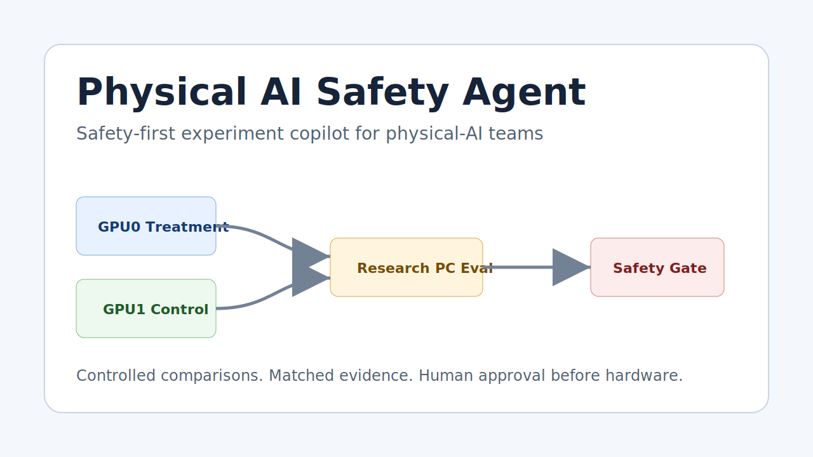
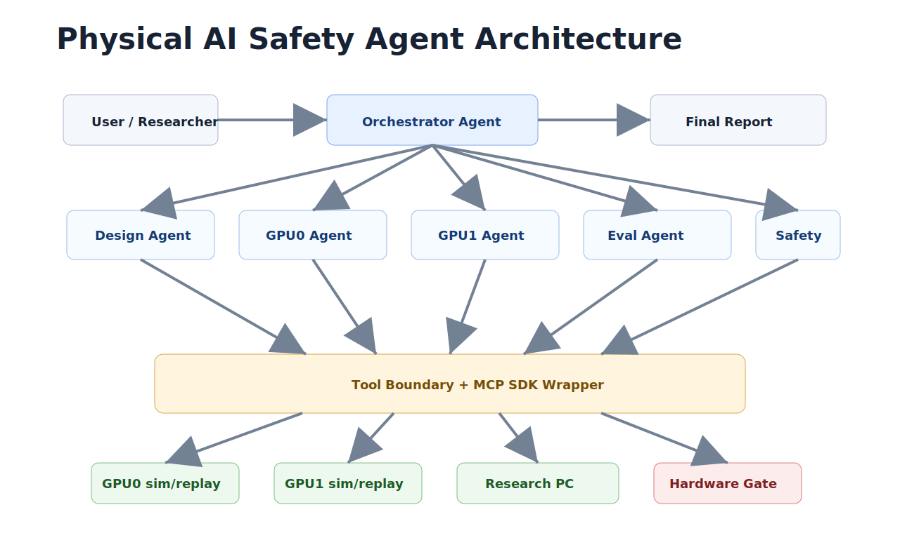

# Physical AI Safety Agent

Safety-first experiment copilot for physical-AI teams.



Physical AI Safety Agent addresses a real-world problem in physical AI: small teams often
run expensive policy experiments, compare results by hand, and risk moving an
unsafe model from simulation toward hardware too early. The first demo uses
humanoid walking because the risk is concrete, but the product value is broader:
helping humans make safer, more reproducible deployment decisions for
physical-world AI systems.

Physical AI Safety Agent turns a scattered physical-AI experiment workflow into a controlled
agentic lab loop:

1. Design a baseline/control and treatment experiment pair.
2. Assign the control and treatment runs to matched training rigs.
3. Run either deterministic mock evidence or sanitized real replay evidence.
4. Evaluate both policies on the researcher PC with the same metrics.
5. Block unsafe hardware claims through a deterministic safety gate.
6. Generate an experiment report and Robot Action Diff.

The public capstone demo never connects to real hardware, never sends motor
commands, and never requires private lab credentials. The training rigs,
researcher PC, and the hardware target are mocked by default. A second
`real_replay` mode reads sanitized aggregate CSV/JSON evidence derived from
private lab logs, with raw logs, hostnames, credentials, private paths, and
checkpoints removed.

## Who This Helps

This project is not framed as an everyday consumer assistant. It fits the
capstone requirement through the real-world problem and people-helping path:

- Physical-AI teams avoid wasting GPU time on uncontrolled comparisons.
- Robotics students learn a repeatable experiment discipline instead of reading
  logs by instinct.
- Small labs get a lightweight safety process without building a full internal
  platform.
- Human operators get an explicit safety gate before a policy is considered for
  hardware.
- Reviewers get reports that explain not only what improved, but what regressed.

The human value is safer and more reproducible physical-AI experimentation. The
agent does not replace the human operator; it organizes evidence so the human
can make a better approval decision.

## Why This Is An Agent Project

This workflow is not a single prompt or a single script. It requires planning,
tool use, monitoring, comparison, safety reasoning, and reporting across several
roles:

- Physical AI Safety Orchestrator Agent
- Experiment Design Agent
- Treatment Training Agent
- Control Training Agent
- Research PC Evaluation Agent
- Policy Failure Analysis Agent
- Sim-to-Real Safety Agent
- Report Agent

## Course Concept Mapping

| Course concept | Physical AI Safety Agent implementation |
| --- | --- |
| Multi-agent orchestration | Separate agents for design, training, evaluation, safety, failure analysis, and reports |
| Tools / MCP | `gaitlab/tools` exposes JSON tool boundaries; `gaitlab/mcp/official_server.py` provides an optional official MCP SDK FastMCP server |
| Google ADK | `gaitlab/adk_app/agent.py` provides an optional ADK `root_agent` wrapper around the same Physical AI Safety Agent tools |
| Agent Skills | `gaitlab/skills` contains portable SKILL.md files for the core workflows |
| Evaluation | `evals/run_evals.py` checks decisions, safety gates, report generation, and replay behavior |
| Security | Public demo blocks hardware commands, uses no secrets, and requires human approval before any lab-mode action |
| Deployability | CLI demo, FastAPI + Next.js dashboard, static demo, optional MCP server, and optional ADK adapter |

## Architecture



## Quick Start

On Windows, create a project-local virtual environment first. This avoids
accidentally using another application's bundled Python from PATH.

```powershell
py -3.12 -m venv .venv
.\.venv\Scripts\python.exe -m pip install -r requirements.txt
```

Run the deterministic CLI demo:

```powershell
.\.venv\Scripts\python.exe run_demo.py
```

Run the sanitized real replay CLI demo:

```powershell
.\.venv\Scripts\python.exe run_demo.py --data-mode real_replay
```

Run evaluation checks:

```powershell
.\.venv\Scripts\python.exe evals\run_evals.py
```

Run the full verification suite:

```powershell
.\.venv\Scripts\python.exe scripts\verify.py
```

Build a public-safe submission zip that excludes `.env`, `.venv`, caches, and
generated private-only outputs:

```powershell
.\.venv\Scripts\python.exe scripts\build_submission_zip.py
```

Check private `.env` configuration without printing secrets:

```powershell
.\.venv\Scripts\python.exe scripts\check_env.py
```

Run the web dashboard (FastAPI backend + Next.js frontend):

```powershell
# Terminal 1 — backend (port 8000)
.\.venv\Scripts\python.exe -m web.backend.run

# Terminal 2 — frontend (port 3000)
cd web\frontend
npm install
npm run dev
```

Open http://localhost:3000 and use the sidebar to switch between
`Mock Demo`, `Sanitized Real Replay`, and `Live Lab`. The frontend proxies
`/api/*` and `/sse/*` to the backend.

In production, `cd web\frontend && npm run build` produces a static export
under `web\frontend\out\`; the FastAPI backend then serves both API and
frontend on a single port.

Open the polished static demo:

```powershell
start .\site\index.html
```

Optional official integrations:

```powershell
.\.venv\Scripts\python.exe -m pip install -e ".[integrations]"
.\.venv\Scripts\python.exe -m gaitlab.mcp.official_server
```

The ADK adapter is exposed at `gaitlab/adk_app/agent.py` as `root_agent`.

## Demo Scenario

The default scenario models the kind of concrete lab request a researcher might
send after reading the latest evaluation logs:

> Recent replay evidence shows the previous stable baseline improved reward, but
> the latest matched evaluation packet still shows forward pitch spikes after
> push recovery and joint-limit usage near the safety limit. Keep the previous
> stable baseline unchanged on the control training rig. On the treatment
> training rig, run one treatment with +30% torso orientation penalty and +15%
> action smoothness using the same seed group and evaluation script. Do not send
> hardware commands; return the comparison, failure notes, and whether this is
> blocked, supported-harness only, or ready for human hardware review.

Expected result:

- Treatment improves fall-free rollouts and torso pitch.
- Treatment regresses velocity and energy usage.
- Unsupervised hardware testing is blocked.
- Supported low-speed testing is allowed only with conditions and human review.

In `real_replay` mode, the same workflow reads redacted aggregate lab evidence
from `demo_data/real_replay`. The treatment replay improves stability against
the replay baseline, but unsupervised hardware testing is still blocked because
the public replay does not include a human emergency-stop dry-run.

## Safety Notes

This repository is intentionally safe-by-default:

- No SSH execution is performed.
- No hardware command is sent.
- No private file path is required.
- No API key is needed.
- Deployment packages are mock manifests only.
- Hardware-facing approval requires all strict safety thresholds to pass.
- Sanitized replay data contains no raw robot logs, credentials, hostnames, or
  private paths.

Private lab values are kept in `.env`. That file is ignored by git and must be
removed before publishing or submitting the project. Keep `.env.example`.

The private lab extension point is the tool boundary in `gaitlab/tools`. A real
lab adapter should implement the same functions while keeping human-in-the-loop
approval and audit logs.

## Repository Layout

The public product name is Physical AI Safety Agent. The Python package remains
`gaitlab` as an internal namespace because the demo scenario originated from
humanoid gait experiments.

```text
SUBMISSION.md                   Submission pack index
web/backend/                   FastAPI backend (REST + SSE) for the dashboard
web/frontend/                  Next.js frontend (React + Tailwind + Recharts)
site/                          Polished static demo for judges and video
run_demo.py                    CLI demo
scripts/verify.py              One-command local verification
scripts/build_submission_zip.py Public-safe zip builder excluding .env and .venv
scripts/build_real_replay.py   Sanitizes private robot CSVs into public replay evidence
gaitlab/                       Agent implementation; internal Python namespace
gaitlab/agents/                Role-specific agents
gaitlab/tools/                 Local tool wrappers
gaitlab/mcp/                   JSON dispatcher and optional official MCP server
gaitlab/adk_app/               Optional Google ADK root agent wrapper
gaitlab/skills/                Portable Agent Skills
demo_data/                     Mock and sanitized replay configs, logs, metrics, artifacts
evals/                         Agent evaluation cases and runner
specs/                         Product, architecture, safety, and tool specs
docs/                          Public diagrams, security model, and evidence notes
```
