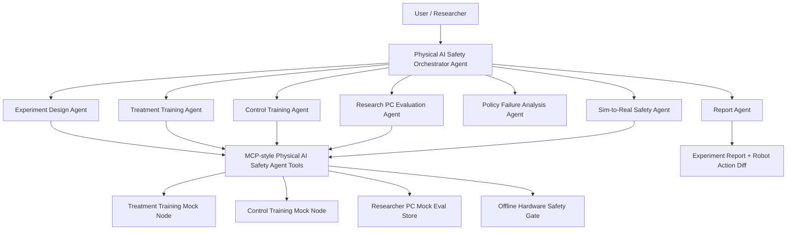

# Architecture

```mermaid
flowchart TD
    U["User / Researcher"] --> O["Physical AI Safety Orchestrator Agent"]
    O --> D["Experiment Design Agent"]
    O --> C0["Treatment Training Agent"]
    O --> C4["Control Training Agent"]
    O --> E["Research PC Evaluation Agent"]
    O --> F["Policy Failure Analysis Agent"]
    O --> S["Sim-to-Real Safety Agent"]
    O --> R["Report Agent"]
    D --> T["MCP-style Physical AI Safety Agent Tools"]
    C0 --> T
    C4 --> T
    E --> T
    S --> T
    T --> M0["Treatment Training Mock Node"]
    T --> M4["Control Training Mock Node"]
    T --> PC["Researcher PC Mock Eval Store"]
    T --> ROBOT["Offline Hardware Safety Gate"]
    R --> OUT["Experiment Report + Robot Action Diff"]
```

The public demo uses local tools but keeps MCP-compatible function boundaries so
private lab adapters can replace mock implementations later.
